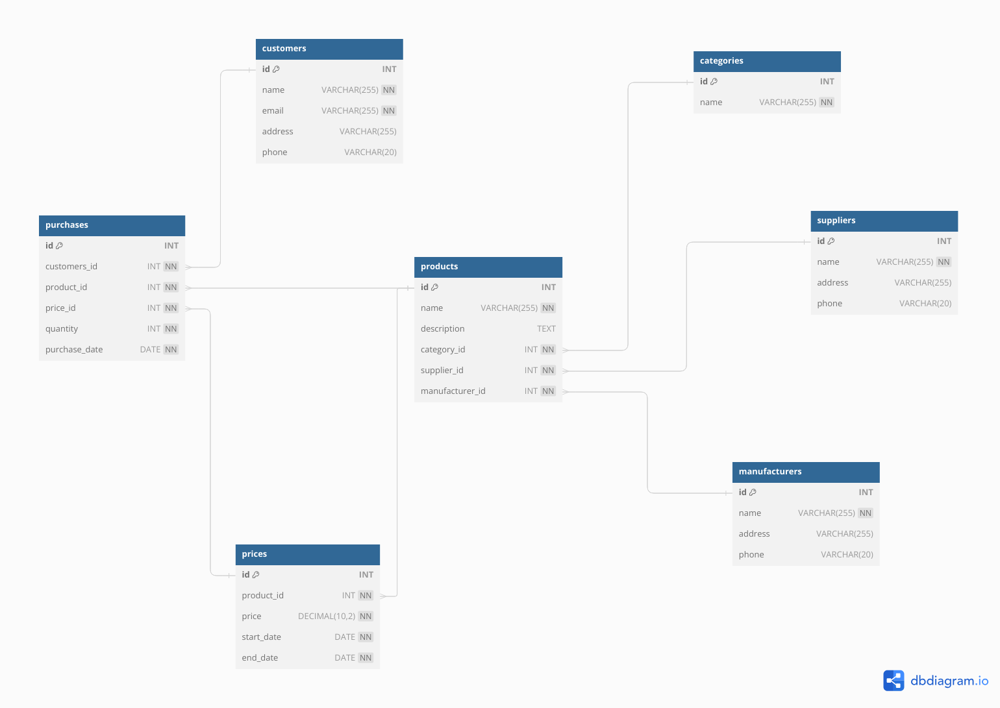

# **Лекция №1: Проектирование БД**
> _Разработка проекта_

## **Задание:**
Разработка проекта

Цель:
Спроектировать свою первую базу данных на курсе

Описание/Пошаговая инструкция выполнения домашнего задания:
Реализуйте сущности продукты, категории продуктов, цены, поставщики, производители, покупатели и покупки .
Свои решения для этой схемы приветствуются
В проекте должны быть

- схема
- описание таблиц и полей
- примеры бизнес-задач которые решает база
- ДЗ автоматически засчитывается при защите проекта на последнем занятии модуля

Критерии оценки:
10 - реализованы сущности и схема
плюс 2 балла за очень интересный проект
минус 2 балла, если работа выполнена, но имеются недостатки и студент не хочет их устранят

## Задание из презентации:
Начинаем готовить дипломный проект. По умолчанию “Интернет-магазин”
Реализуйте сущности продукты, категории продуктов, цены, поставщики, производители,
покупатели и покупки. Свои решения для этой схемы приветствуются
В проекте должны быть
- схема
- описание таблиц и полей
- примеры бизнес-задач которые решает база
  Сдача дз в виде ссылки на гитхаб с описанием проекта в markdown и схемой данных
  Пример: https://github.com/aeuge/Postgres14book
  ДЗ автоматически засчитывается при защите проекта на последнем занятии модуля
  10 - реализованы сущности и схема
  плюс 2 балла за очень интересный проект
  минус 2 балла, если работа выполнена, но имеются недостатки и студент не хочет их устранять

---

## **Выполнено:**

Реализуемые сущности (таблицы):
- Продукты (products) 
- Категории продуктов (categories)
- Цены (prices)
- Поставщики (suppliers)
- Производители (manufacturers)
- Покупатели (customers)
- Покупки (purchases)

Описание таблиц и полей

~~~sql
CREATE TABLE products (
  id INT PRIMARY KEY,
  name VARCHAR(255) NOT NULL,
  description TEXT,
  category_id INT NOT NULL,
  supplier_id INT NOT NULL,
  manufacturer_id INT NOT NULL,
  FOREIGN KEY (category_id) REFERENCES categories(id),
  FOREIGN KEY (supplier_id) REFERENCES suppliers(id),
  FOREIGN KEY (manufacturer_id) REFERENCES manufacturers(id)
);

CREATE TABLE categories (
  id INT PRIMARY KEY,
  name VARCHAR(255) NOT NULL
);

CREATE TABLE prices (
  id INT PRIMARY KEY,
  product_id INT NOT NULL,
  price DECIMAL(10, 2) NOT NULL,
  start_date DATE NOT NULL,
  end_date DATE NOT NULL,
  FOREIGN KEY (product_id) REFERENCES products(id)
);

CREATE TABLE suppliers (
  id INT PRIMARY KEY,
  name VARCHAR(255) NOT NULL,
  address VARCHAR(255),
  phone VARCHAR(20)
);

CREATE TABLE manufacturers (
  id INT PRIMARY KEY,
  name VARCHAR(255) NOT NULL,
  address VARCHAR(255),
  phone VARCHAR(20)
);

CREATE TABLE customers (
  id INT PRIMARY KEY,
  name VARCHAR(255) NOT NULL,
  email VARCHAR(255) NOT NULL,
  address VARCHAR(255),
  phone VARCHAR(20)
);

CREATE TABLE purchases (
  id INT PRIMARY KEY,
  customer_id INT NOT NULL,
  product_id INT NOT NULL,
  price_id INT NOT NULL,
  quantity INT NOT NULL,
  purchase_date DATE NOT NULL,
  FOREIGN KEY (customer_id) REFERENCES customers(id),
  FOREIGN KEY (product_id) REFERENCES products(id),
  FOREIGN KEY (price_id) REFERENCES prices(id)
);
~~~

# **Полезное:**

Изучаем github.com и маркдаун (markdown)
- Также много ссылок длā дополнительного изучения в ЛК
- Естþ GUI для гитхаба https://www.syntevo.com/smartgit/
- Пример маркдауна https://github.com/aeuge/Postgres14book
- Как составлять схемы:
  - https://dbdiagram.io/
  - https://sqldbm.com/Home/ - рекомендация, можно генерить sql
  - https://app.diagrams.net/
  - https://www.mysql.com/products/workbench/
  - https://dbeaver.io/
  - http://dbdoc.sourceforge.net/
