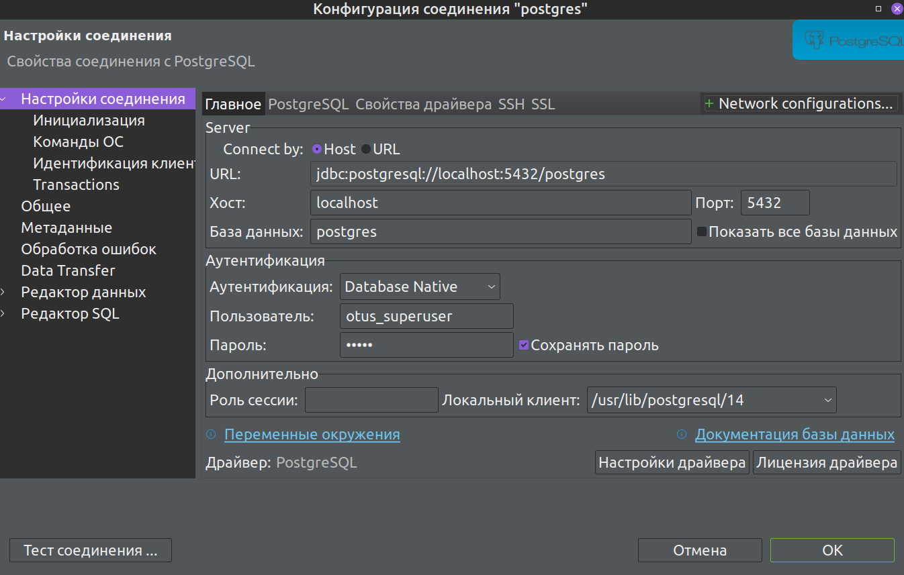
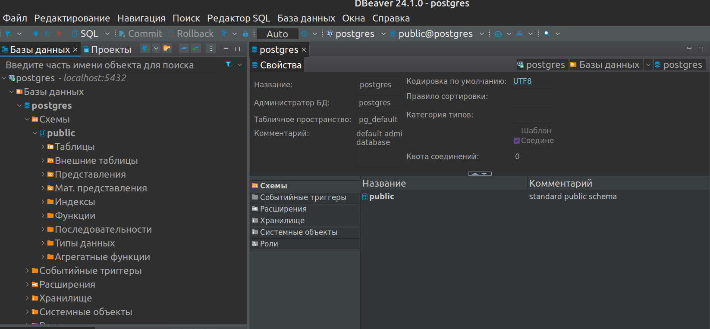

# **Лекция №6: Внутренняя архитектура СУБД PostgreSQL**
> _Разработка проекта_

## **Задание:**
Установка СУБД PostgreSQL

Цель:
Создать кластер PostgreSQL в докере или на виртуальной машине, запустить сервер и подключить клиента

Описание/Пошаговая инструкция выполнения домашнего задания:
Развернуть контейнер с PostgreSQL или установить СУБД на виртуальную машину.
Запустить сервер.
Создать клиента с подключением к базе данных postgres через командную строку.
Подключиться к серверу используя pgAdmin или другое аналогичное приложение.

Критерии оценки:
Выполнение ДЗ: 10 баллов
плюс 2 балла за красивое решение
минус 2 балла за рабочее решение, и недостатки указанные преподавателем не устранены
---

## **Выполнено:**

1.ВМ с ОС Centos 7 поднимается помощью ПО Vagrant (версии 2.2.19). По окончании развертывания просходит автоматический 
запуск её провижионинга с установкой и настройкой СУБД PostrgreSQL 15
~~~bash
vagrant up
~~~

2.Создание клиента с подключением к базе данных postgres через командную строку.
~~~bash
vagrant ssh
sudo su postgres
cd
psql -c '\c'
~~~

3.Подключение к серверу используя pgAdmin или другое аналогичное приложение: DBeaver

