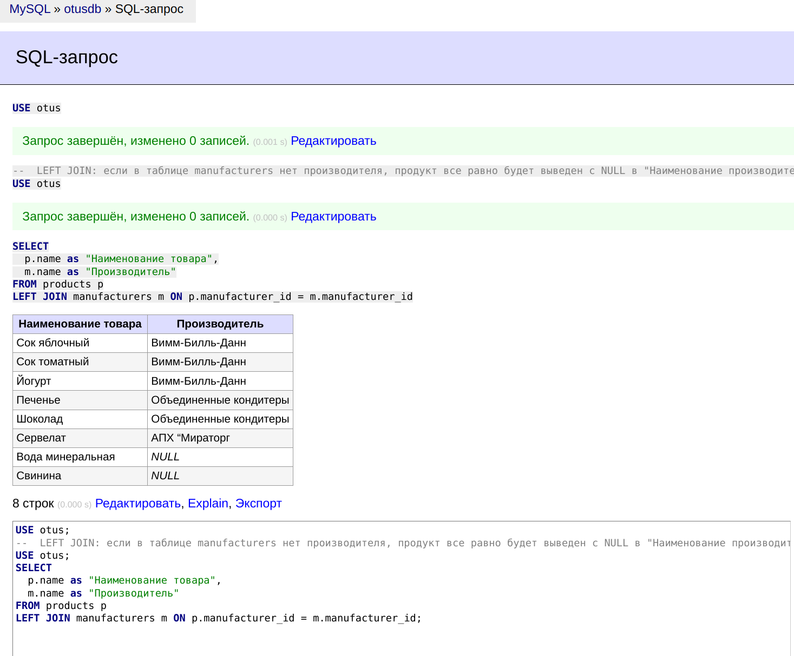
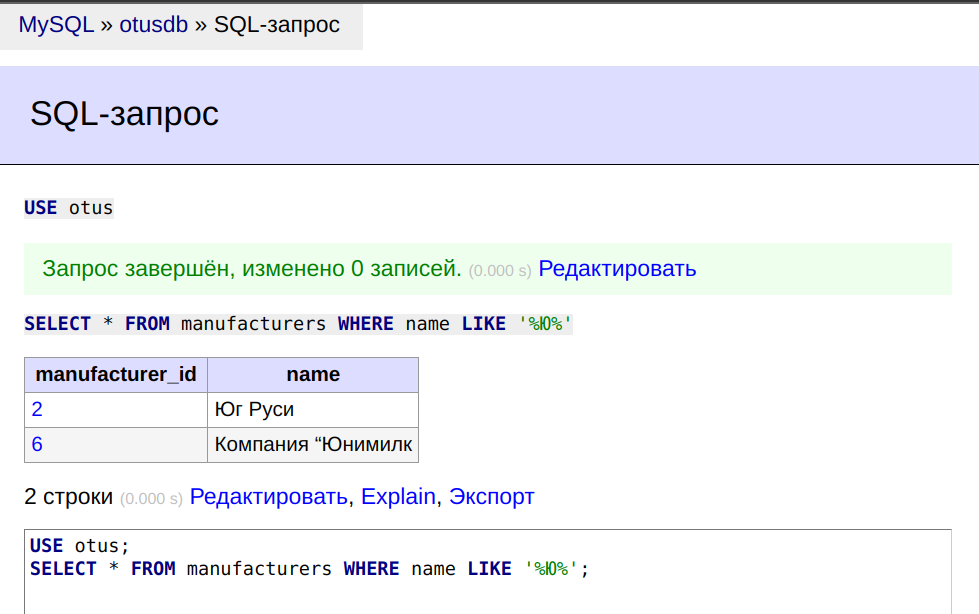
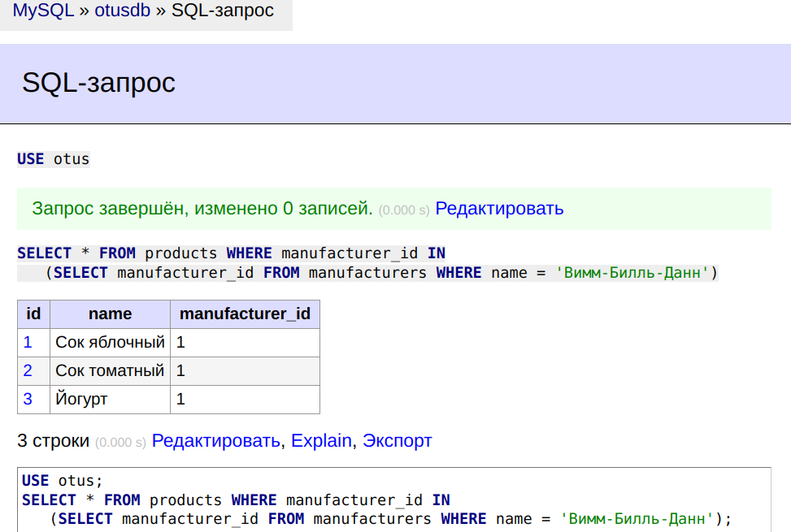
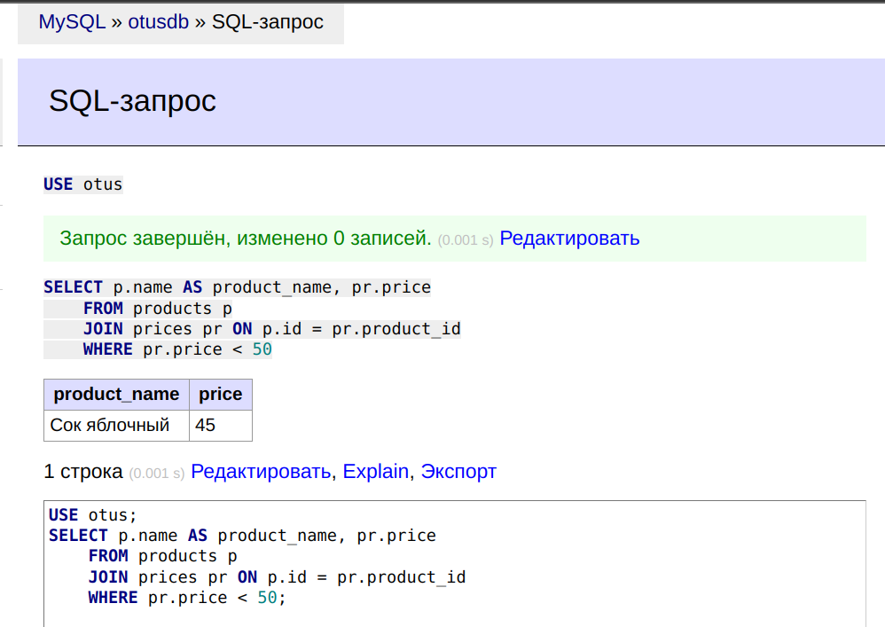
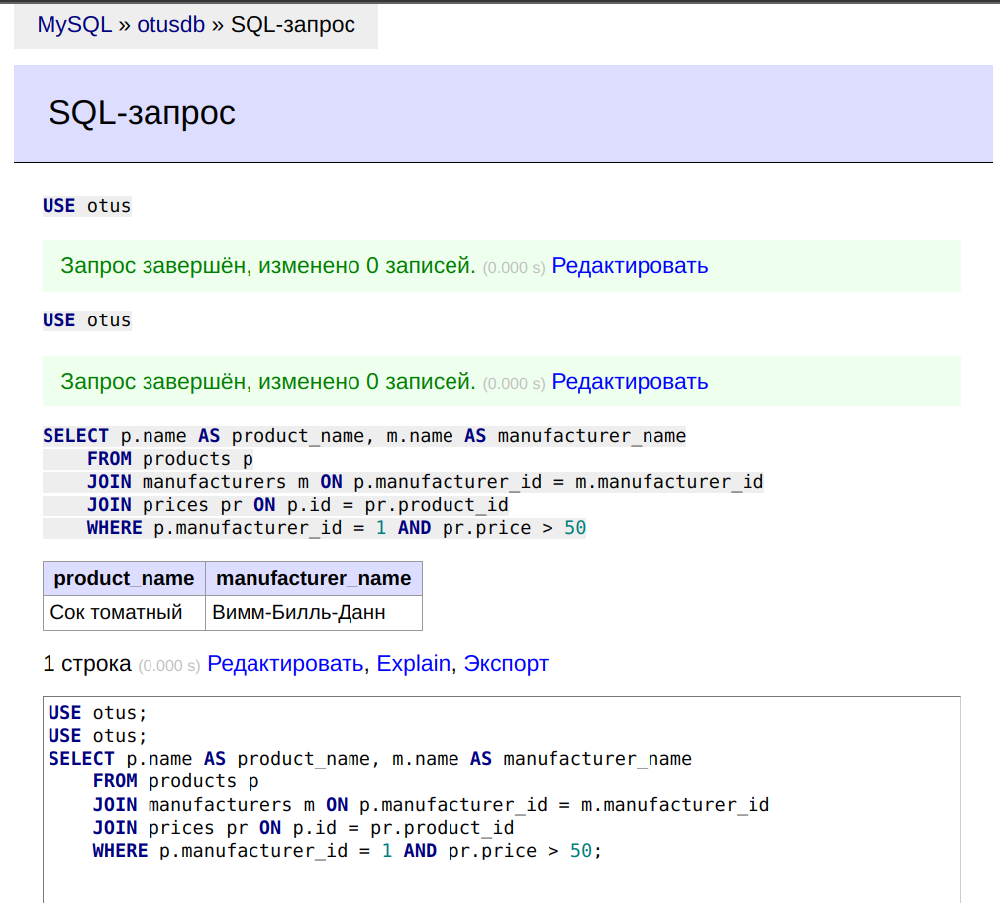
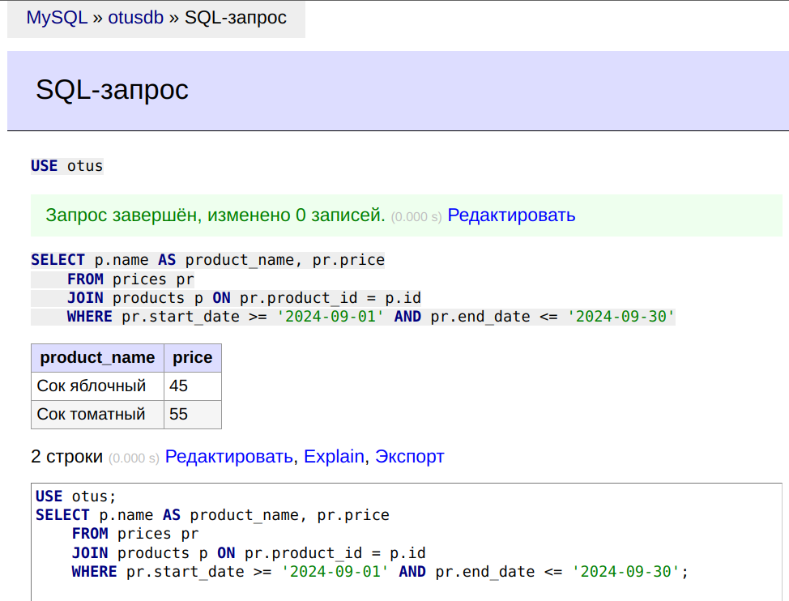

# **Лекция №25: DML: вставка, обновление, удаление, выборка данных**
> _Разработка проекта_

## **Задание:**
SQL выборка

Цель:
Научиться джойнить таблицы и использовать условия в SQL выборке

Описание/Пошаговая инструкция выполнения домашнего задания:
Напишите запрос по своей базе с inner join
Напишите запрос по своей базе с left join
Напишите 5 запросов с WHERE с использованием разных
операторов, опишите для чего вам в проекте нужна такая выборка данных

Критерии оценки:
Выполнение ДЗ: 10 баллов
плюс 2 балла за красивое решение
минус 2 балла за рабочее решение, и недостатки указанные преподавателем не устранены
---

## **Выполнено:**

#### 1. Напишите запрос по своей базе с inner join
~~~sql
--  INNER JOIN будут выведены только те продукты, у которых производитель не NULL
USE otus;
SELECT
  p.name as "Наименование товара",
  m.name as "Производитель"
FROM products p
INNER JOIN manufacturers m ON p.manufacturer_id = m.manufacturer_id;
~~~


#### 2. Напишите запрос по своей базе с left join
~~~sql
--  LEFT JOIN: если в таблице manufacturers нет производителя, продукт все равно будет выведен с NULL в "Наименование производителя"
USE otus;
SELECT
  p.name as "Наименование товара",
  m.name as "Производитель"
FROM products p
LEFT JOIN manufacturers m ON p.manufacturer_id = m.manufacturer_id;
~~~


#### 3. Напишите 5 запросов с WHERE с использованием разных операторов, опишите для чего вам в проекте нужна такая выборка данных

Найти всех производителей, наименование которых включает заглавную `Ю` 
```mysql
USE otus;
SELECT * FROM manufacturers WHERE name LIKE '%Ю%';
```


Найти все продукты производителя `Вимм-Билль-Данн`
```mysql
USE otus;
SELECT * FROM products WHERE manufacturer_id IN
   (SELECT manufacturer_id FROM manufacturers WHERE name = 'Вимм-Билль-Данн');
```


Вывести наименование продукта и его цену, цена продукта у которых меньше 50
```mysql
USE otus;
SELECT p.name AS product_name, pr.price
    FROM products p
    JOIN prices pr ON p.id = pr.product_id
    WHERE pr.price < 50;
```


Вывести наименование продукта и его производителя, у которого manufacturer_id равен 3 и цена продукта больше 50:
```mysql
USE otus;
SELECT p.name AS product_name, m.name AS manufacturer_name
    FROM products p
    JOIN manufacturers m ON p.manufacturer_id = m.manufacturer_id
    JOIN prices pr ON p.id = pr.product_id
    WHERE p.manufacturer_id = 1 AND pr.price > 50;
```


Вывести наименование продукта и цен и для всех записей цены  
у которых дата начала больше или равна 1 сентября 2024 года и дата окончания меньше или равна 30 сентября 2024 года.
```mysql
USE otus;
SELECT p.name AS product_name, pr.price
    FROM prices pr
    JOIN products p ON pr.product_id = p.id
    WHERE pr.start_date >= '2024-09-01' AND pr.end_date <= '2024-09-30';
```

