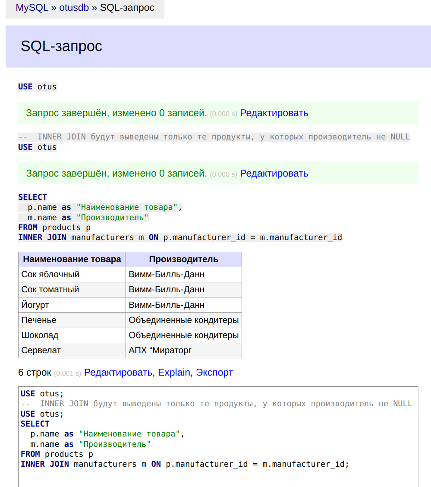

# **Лекция №25: DML: вставка, обновление, удаление, выборка данных**
> _Разработка проекта_

## **Задание:**
SQL выборка

Цель:
Научиться джойнить таблицы и использовать условия в SQL выборке

Описание/Пошаговая инструкция выполнения домашнего задания:
Напишите запрос по своей базе с inner join
Напишите запрос по своей базе с left join
Напишите 5 запросов с WHERE с использованием разных
операторов, опишите для чего вам в проекте нужна такая выборка данных

Критерии оценки:
Выполнение ДЗ: 10 баллов
плюс 2 балла за красивое решение
минус 2 балла за рабочее решение, и недостатки указанные преподавателем не устранены
---

## **Выполнено:**

1. Напишите запрос по своей базе с inner join
~~~sql
--  INNER JOIN будут выведены только те продукты, у которых производитель не NULL
USE otus;
SELECT
  p.name as "Наименование товара",
  m.name as "Производитель"
FROM products p
INNER JOIN manufacturers m ON p.manufacturer_id = m.manufacturer_id;
~~~

2. Напишите запрос по своей базе с left join
~~~sql
--  LEFT JOIN: если в таблице manufacturers нет производителя, продукт все равно будет выведен с NULL в "Наименование производителя"
USE otus;
SELECT
  p.name as "Наименование товара",
  m.name as "Производитель"
FROM products p
LEFT JOIN manufacturers m ON p.manufacturer_id = m.manufacturer_id;
~~~

