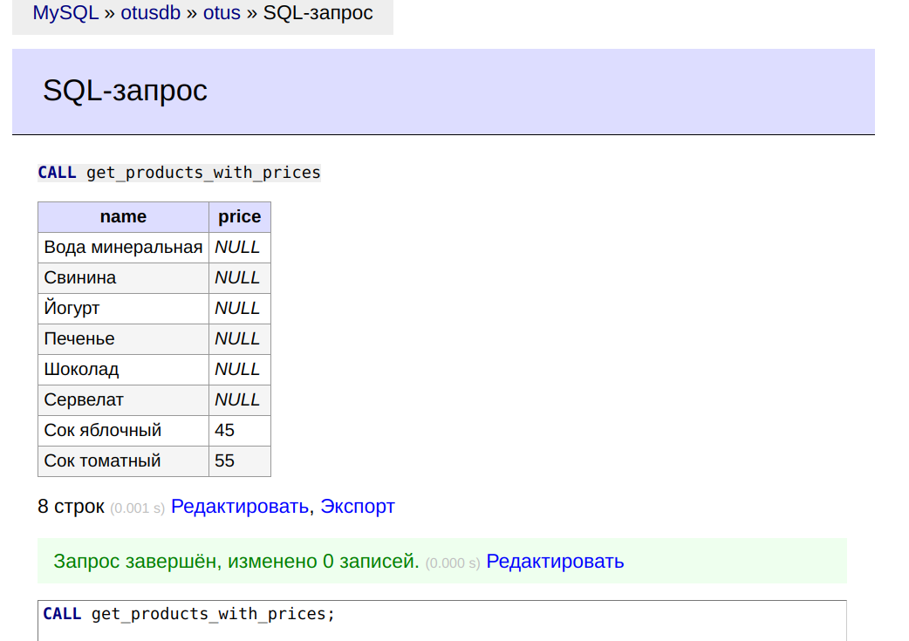
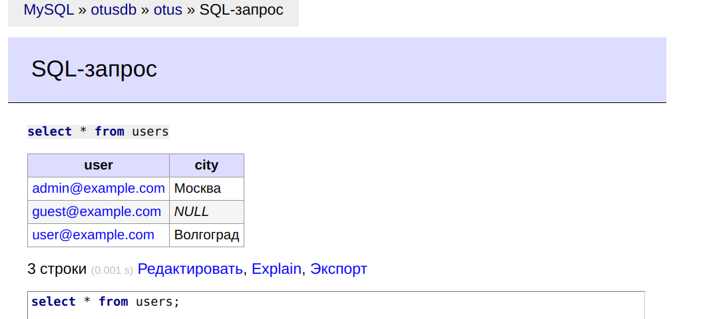

# **Лекция №26: Транзакции, MVCC, ACID**
> _Разработка проекта_

## **Задание:**
Транзакции

Цель:
Заполнить свой проект данными.

Описание/Пошаговая инструкция выполнения домашнего задания:
Описать пример транзакции из своего проекта с изменением данных в нескольких таблицах. Реализовать в виде хранимой процедуры.
Загрузить данные из приложенных в материалах csv.
Реализовать следующими путями:
LOAD DATA

Задание со *: загрузить используя
mysqlimport

Критерии оценки:
Выполнение ДЗ: 10 баллов
плюс 5 баллов за задание со *
плюс 2 балла за красивое решение
минус 2 балла за рабочее решение, и недостатки указанные преподавателем не устранены

---

## **Выполнено:**

#### 1. Описать пример транзакции из своего проекта с изменением данных в нескольких таблицах. Реализовать в виде хранимой процедуры.

Создание хранимой процедуры вывода двух столбцов: 
name - название продукта и price - цена продукта. 
Результат отсортирован по возрастанию цены.  

```
DELIMITER //
CREATE PROCEDURE get_products_with_prices()
BEGIN
    SELECT p.name, pr.price
    FROM products p
    LEFT JOIN prices pr ON p.id = pr.product_id
    ORDER BY pr.price ASC;
END //
DELIMITER ;
```

Выполнение хранимой процедуры
```
CALL get_products_with_prices;
```



#### 2. Загрузить данные из приложенных в материалах csv. Реализовать следующими путями: LOAD DATA

Создадим таблицу

```sql
CREATE TABLE IF NOT EXISTS users (
    user VARCHAR(32) NOT NULL PRIMARY KEY,
    city VARCHAR(32)
);
```

```sql
LOAD DATA INFILE '/home/root/users-39289-9e5604.csv'
INTO TABLE users
FIELDS TERMINATED BY ',';
```


#### 3. Задание со ⭐️: загрузить используя mysqlimport

Донастроим права
```mysql
ALTER USER 'root'@'localhost' IDENTIFIED WITH mysql_native_password BY 'Current-Root-Password';
FLUSH PRIVILEGES;
```

Зайдем в контейнер и запустим процедуру импорта
```bash
docker-compose exec otusdb bash
cp /home/root/users-39289-9e5604.csv /home/root/users.csv
mysqlimport --delete --fields-terminated-by=','  --user="root" --password="12345" otus /home/root/users.csv
```

```console
mysqlimport: [Warning] Using a password on the command line interface can be insecure.
otus.users: Records: 3  Deleted: 0  Skipped: 0  Warnings: 0
```