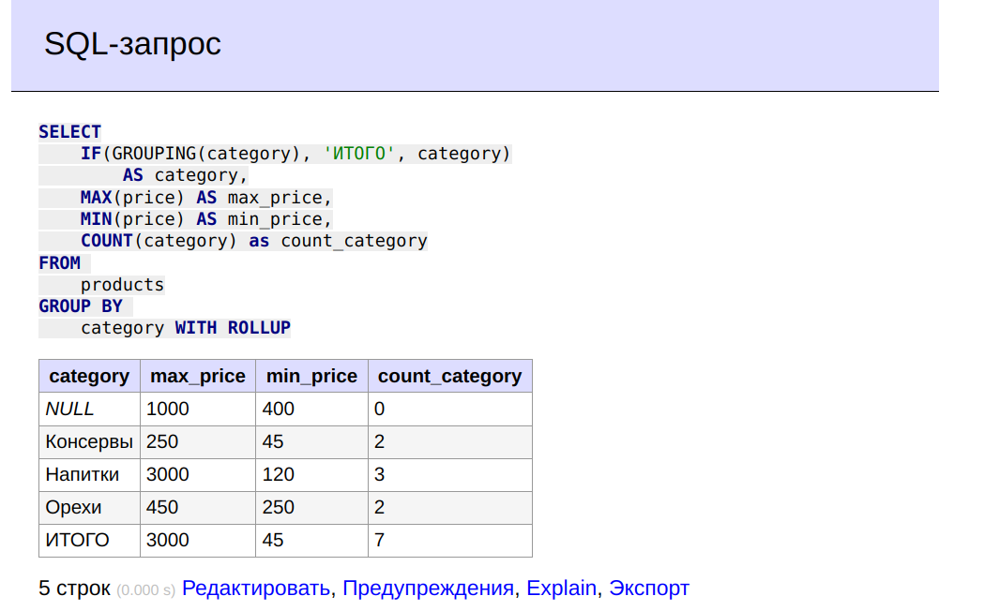
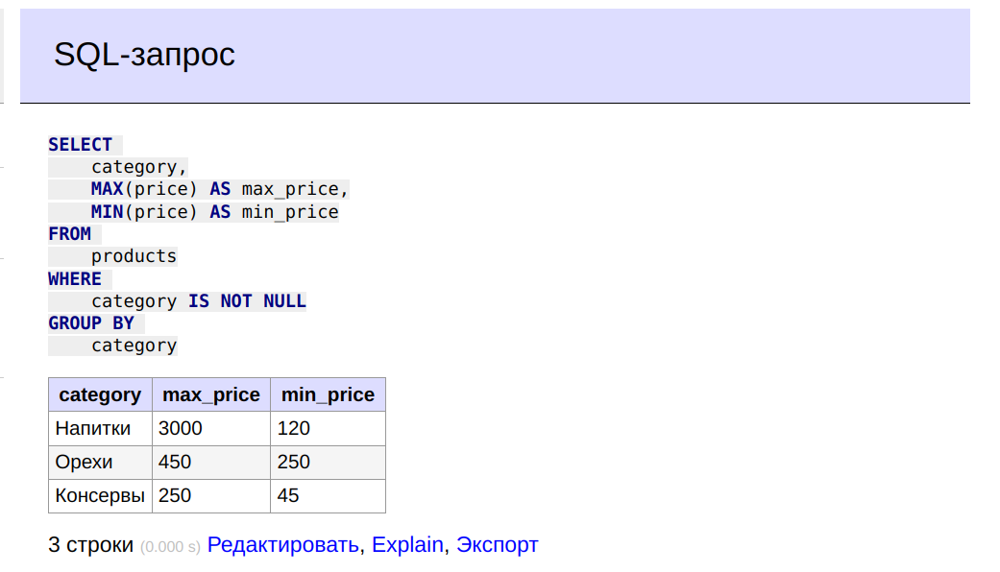
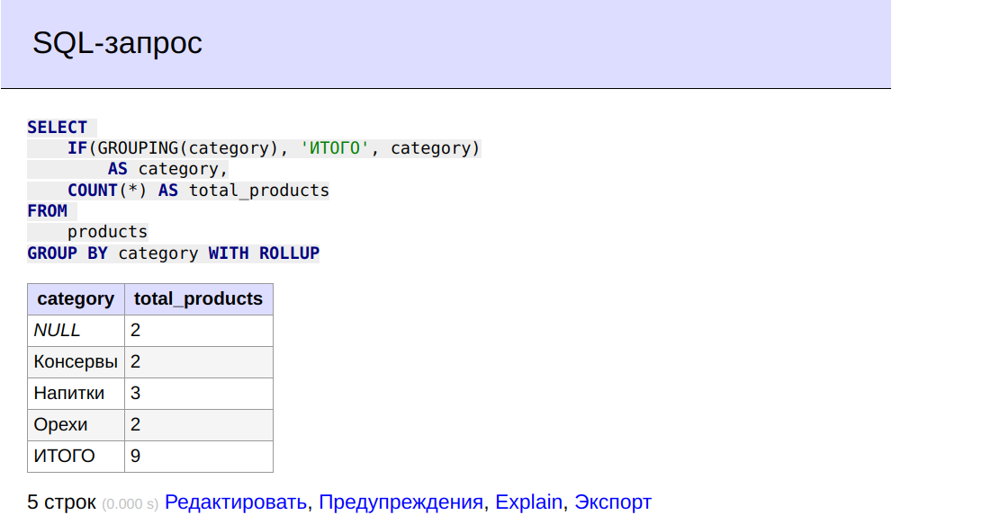

# **Лекция №27: DML: агрегация и сортировка**
> _Разработка проекта_

## **Задание:**
Создаем отчетную выборку

Цель:
Создавать отчетную выборку.

Описание/Пошаговая инструкция выполнения домашнего задания:
Предоставить следующий результат:

группировки с ипользованием CASE, HAVING, ROLLUP, GROUPING() :
для магазина к предыдущему списку продуктов добавить максимальную и минимальную цену и кол-во предложений
сделать выборку показывающую самый дорогой и самый дешевый товар в каждой категории
сделать rollup с количеством товаров по категориям

Критерии оценки:
Выполнение ДЗ: 10 баллов
плюс 2 балла за красивое решение
минус 2 балла за рабочее решение, и недостатки указанные преподавателем не устранены

---

## **Выполнено:**

Подготовка тестовой базы

```mysql
DROP DATABASE IF EXISTS otus_rdbms_dml_aggregate;
CREATE DATABASE otus_rdbms_dml_aggregate;
USE otus_rdbms_dml_aggregate;
```
```mysql
DROP TABLE IF EXISTS products;

CREATE TABLE products (
    title VARCHAR(32) NOT NULL,
    category VARCHAR(32),
    price INT,
    rating INT,
    status VARCHAR(32) NOT NULL,
    PRIMARY KEY (title)
);
```

```mysql
INSERT INTO products
    (title, category, price, rating, status)
VALUES
    ('Агдам', 'Напитки', 150, 2, 'В наличии'),
    ('Килька', 'Консервы', 45, 4, 'Распродан'),
    ('Оливки', 'Консервы', 250, 5, 'Распродан'),
    ('Текила', 'Напитки', 3000, 5, 'В наличии'),
    ('Шмурдяк', 'Напитки', 120, 1, 'Распродан'),
    ('Арахис', 'Орехи', 250, 5, 'Распродан'),
    ('Фисташки', 'Орехи', 450, 5, 'В наличии');
```

```mysql
INSERT INTO products
    (title, category, price, rating, status)
VALUES
    ('Непонятная фигня 1', NULL, 400, NULL, 'В наличии'),
    ('Непонятная фигня 2', NULL, 1000, NULL, 'В наличии');
```

```mysql
SELECT * FROM products;
```

#### 1. К списку продуктов добавить максимальную и минимальную цену и кол-во предложений

```
SELECT
    IF(GROUPING(category), 'ИТОГО', category)
        AS category,
    MAX(price) AS max_price,
    MIN(price) AS min_price,
    COUNT(category) as сount_category
FROM 
    products
GROUP BY 
    category WITH ROLLUP;
```


#### 2. Сделать выборку, показывающую самый дорогой и самый дешевый товар в каждой категории

```
SELECT 
    category,
    MAX(price) AS max_price,
    MIN(price) AS min_price
FROM 
    products
WHERE 
    category IS NOT NULL
GROUP BY 
    category;
```


#### 3. Сделать rollup с количеством товаров по категориям

```
SELECT 
    IF(GROUPING(category), 'ИТОГО', category)
        AS category,
    COUNT(*) AS total_products
FROM 
    products
GROUP BY category WITH ROLLUP;
```

