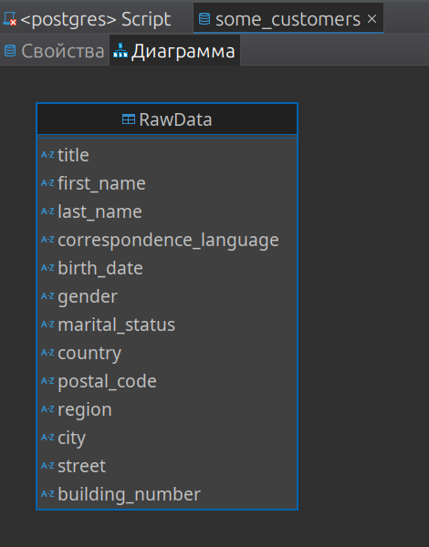
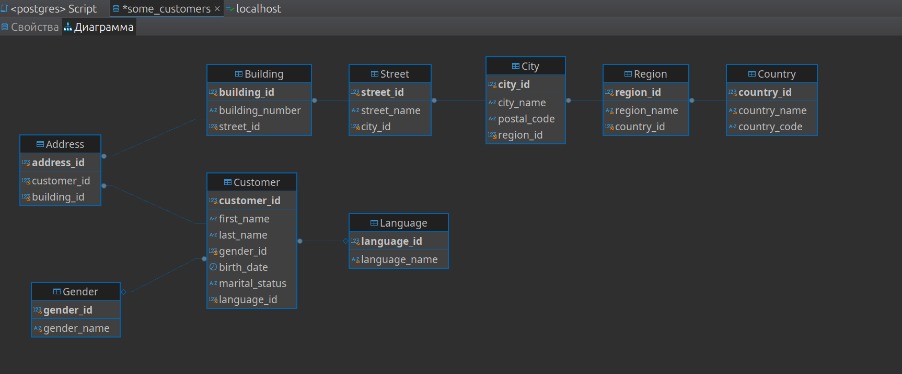
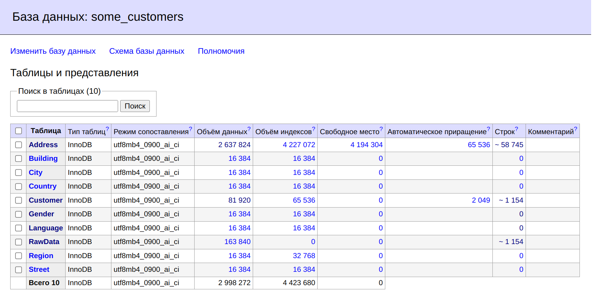

# **Лекция №35: MySQL - InnoDB Cluster**
> _Разработка проекта_

## **Задание:**
Домашнее задание
Строим модель данных

Цель:
Научиться проектировать БД.


Описание/Пошаговая инструкция выполнения домашнего задания:
Задача: реализовать модель данных БД, определить сущности, построить связи, выполнить декомпозицию и нормализацию


За основу берем практическую структуру данных с заказчиками интернет магазина (файл some_customers.csv.gz).


Текущая структура данных неоптимальна:

нет типизации - почти все поля хранятся как строки
данные не нормализованы - данные о адресе и человеке хранятся в одной таблице, на одного человека может приходится несколько адресов

Попытаться выделить следующие сущности:

страны
города
улицы
дома
и другие которые посчитаете нужными

Описанные сущности не являются полным и конечным ТЗ (как это и бывает в жизни). Вы как архитектор должны предусмотреть необходимые атрибуты и дополнительные сущности по необходимости. И четко представлять бизнес-задачу которую будет решать эта структура данных.


делаем декомпозицию и нормализацию

в качестве сделанной ДЗ принимается pdf с начальной и конечной моделью


Решая данное ДЗ вы тренируете навык проектирования БД, выделения сущностей и их атрибутов, построения связей, нормализации данных

_____________________________________________________________________________________________________________________________________________________

Задание повышенной сложности*

плюс 10 баллов загрузить данные из CSV в вашу модель

плюс 3 балла за развернутый кластер innodb с роутером и проверкой работоспособности


Критерии оценки:
Выполнение ДЗ: 10 баллов
плюс 2 балла за красивое решение
минус 2 балла за рабочее решение, и недостатки указанные преподавателем не устранены
плюс 10 баллов данные из CSV загружены в БД
плюс 3 балла за каждый развернутый кластер: innoDB, XtraDB, NDB

---

## **Выполнено:**

### 1. Начальная модель:

- Создадим таблицу
~~~sql
DROP TABLE IF EXISTS RawData;

CREATE TABLE IF NOT EXISTS RawData (
    title VARCHAR(20), -- Обращение (Mr, Mrs и т. д.)
    first_name VARCHAR(50),
    last_name VARCHAR(50),
    correspondence_language VARCHAR(20),
    birth_date VARCHAR(10),
    gender VARCHAR(10),
    marital_status VARCHAR(20),
    country VARCHAR(100),
    postal_code VARCHAR(20),
    region VARCHAR(100),
    city VARCHAR(100),
    street VARCHAR(100),
    building_number VARCHAR(20)
);
~~~

- Загрузим собственно данные
~~~
LOAD DATA INFILE '/home/root/some_customers.csv'
INTO TABLE RawData
FIELDS TERMINATED BY ','
ENCLOSED BY '"'
LINES TERMINATED BY '\n'
IGNORE 1 ROWS;
~~~

- Начальная модель



### 2. Декомпозиция и нормализация
Исходная структура данных содержит все атрибуты, относящиеся как к клиентам, так и к их адресам, в одной таблице. Это создаёт избыточность и потенциальные сложности при масштабировании и поддержке данных. Например, если один клиент имеет несколько адресов, его персональная информация будет дублироваться.

#### 2.1 Этап декомпозиции
Разделим исходную таблицу на отдельные сущности, чтобы минимизировать дублирование и логически разделить данные:

- `Customer` (Клиент): Данные о клиенте (имя, фамилия, пол, дата рождения и т. д.).
- `Country` (Страна): Уникальные страны с атрибутами, такими как название и код страны.
- `City` (Город): Города, ссылающиеся на страну, включающие название, почтовый индекс и регион.
- `Street` (Улица): Названия улиц, принадлежащих определённому городу.
- `Building` (Здание): Номер здания, а также возможные дополнительные данные, такие как корпус или дополнительная информация.

#### 2.2 Этап нормализации
   
Нормализация состоит из последовательного применения нормальных форм, чтобы устранить избыточность и аномалии вставки, обновления или удаления данных.

##### Первая нормальная форма (1NF):
Убедимся, что каждая колонка содержит атомарные значения (например, адрес разбит на страну, город, улицу, здание).
У каждой строки должен быть уникальный идентификатор (например, customer_id).

##### Вторая нормальная форма (2NF):
Убираем зависимость от части составного ключа. Например, адрес (страна, город, улица, дом) выносим в отдельные таблицы, чтобы он не зависел от клиента.

##### Третья нормальная форма (3NF):
Убираем транзитивные зависимости. Например, информация о стране не должна зависеть от города, она переносится в отдельную таблицу стран.
 
#### 2.3 Конечная модель
На выходе получаем нормализованную структуру данных, представленную в следующих таблицах:

**Country**

Описывает страны.

Поля:
- country_id (PK): Уникальный идентификатор страны.
- country_name: Название страны.
- country_code: Код страны (например, US, RU).

**Region**

Описывает регионы (штаты, области) внутри стран.

Поля:
- region_id (PK): Уникальный идентификатор региона.
- region_name: Название региона.
- country_id (FK): Ссылка на страну.

**City**

Описывает города.

Поля:
- city_id (PK): Уникальный идентификатор города.
- city_name: Название города.
- postal_code: Почтовый код города.
- region_id (FK): Ссылка на регион.
 
**Street**

Описывает улицы.

Поля:
- street_id (PK): Уникальный идентификатор улицы.
- street_name: Название улицы.
- city_id (FK): Ссылка на город.

**Building**
   
Описывает здания (дома).
Поля:
- building_id (PK): Уникальный идентификатор здания.
- building_number: Номер здания (например, 12A).
- street_id (FK): Ссылка на улицу.

**Language**
   
Список поддерживаемых языков корреспонденции.
Поля:
- language_id (PK): Уникальный идентификатор языка.
- language_name: Название языка (например, English, French).

**Gender**

Описывает пол клиентов.
Поля:
- gender_id: Уникальный идентификатор пола
- gender_name: Пол 

**Customer**

Описывает клиентов.
Поля:
- customer_id (PK): Уникальный идентификатор клиента.
- first_name: Имя клиента.
- last_name: Фамилия клиента.
- birth_date: Дата рождения.
- marital_status: Семейное положение.
- gender_id(FK): Ссылка на пол клиента.
- language_id (FK): Ссылка на язык корреспонденции.

**Address**
Связывает клиентов с их адресами.

Поля:
- address_id (PK): Уникальный идентификатор адреса.
- customer_id (FK): Ссылка на клиента.
- building_id (FK): Ссылка на здание.

#### 2.5 Связи между таблицами

- Каждый клиент может иметь несколько адресов → связь Customer и Address — один ко многим.
- Каждый адрес ссылается на одно конкретное здание.
- Каждое здание принадлежит конкретной улице.
- Каждая улица расположена в определённом городе.
- Каждый город находится в определённой стране.
   
***Преимущества:***
   
- Уменьшается избыточность: данные о странах, городах и улицах хранятся единожды.
- Лёгкость обновления: изменение информации о городе или стране требует изменения только в одной таблице.
- Масштабируемость: легко добавлять новые адреса, не дублируя данные клиента.


### 3. Конечная  модель:

#### DDL
```mysql
CREATE TABLE Country (
    country_id INT AUTO_INCREMENT PRIMARY KEY,
    country_name VARCHAR(100) NOT NULL UNIQUE,
    country_code CHAR(2)
);

CREATE TABLE Region (
    region_id INT AUTO_INCREMENT PRIMARY KEY,
    region_name VARCHAR(100) NOT NULL UNIQUE,
    country_id INT NOT NULL,
    FOREIGN KEY (country_id) REFERENCES Country(country_id) ON DELETE CASCADE
);

CREATE TABLE City (
    city_id INT AUTO_INCREMENT PRIMARY KEY,
    city_name VARCHAR(100) NOT NULL,
    postal_code VARCHAR(20),
    region_id INT NOT NULL,
    FOREIGN KEY (region_id) REFERENCES Region(region_id) ON DELETE CASCADE
);

CREATE TABLE Street (
    street_id INT AUTO_INCREMENT PRIMARY KEY,
    street_name VARCHAR(100) NOT NULL,
    city_id INT NOT NULL,
    FOREIGN KEY (city_id) REFERENCES City(city_id) ON DELETE CASCADE
);

CREATE TABLE Building (
    building_id INT AUTO_INCREMENT PRIMARY KEY,
    building_number VARCHAR(20) NOT NULL,
    street_id INT NOT NULL,
    FOREIGN KEY (street_id) REFERENCES Street(street_id) ON DELETE CASCADE
);

CREATE TABLE Language (
    language_id INT AUTO_INCREMENT PRIMARY KEY,
    language_name VARCHAR(50) NOT NULL UNIQUE
);

CREATE TABLE Gender (
    gender_id INT AUTO_INCREMENT PRIMARY KEY,
    gender_name VARCHAR(20) NOT NULL UNIQUE
);

CREATE TABLE Customer (
    customer_id INT AUTO_INCREMENT PRIMARY KEY,
    first_name VARCHAR(50) NOT NULL,
    last_name VARCHAR(50) NOT NULL,
    gender_id INT, -- Ссылка на таблицу Gender
    birth_date DATE,
    marital_status VARCHAR(20),
    language_id INT,
    FOREIGN KEY (gender_id) REFERENCES Gender(gender_id) ON DELETE SET NULL,
    FOREIGN KEY (language_id) REFERENCES Language(language_id) ON DELETE SET NULL
);

CREATE TABLE Address (
    address_id INT AUTO_INCREMENT PRIMARY KEY,
    customer_id INT NOT NULL,
    building_id INT NOT NULL,
    FOREIGN KEY (customer_id) REFERENCES Customer(customer_id) ON DELETE CASCADE,
    FOREIGN KEY (building_id) REFERENCES Building(building_id) ON DELETE CASCADE
);

```

#### Диаграмма


### 4. Загрузка данных в нормализованную БД

~~~sql
INSERT INTO Gender (gender_name)
SELECT DISTINCT gender
FROM RawData
WHERE gender IS NOT NULL;
~~~

~~~sql
INSERT INTO Country (country_name, country_code)
SELECT DISTINCT country, NULL
FROM RawData
WHERE country IS NOT NULL;
~~~

~~~sql
INSERT INTO Region (region_name, country_id)
SELECT DISTINCT 
    r.region, 
    c.country_id
FROM RawData r
JOIN Country c ON r.country = c.country_name
WHERE r.region IS NOT NULL AND r.region != '';
~~~

~~~sql
INSERT INTO City (city_name, postal_code, region_id)
SELECT DISTINCT r.city, r.postal_code, rg.region_id
FROM RawData r
JOIN Region rg ON r.region = rg.region_name
WHERE r.city IS NOT NULL;
~~~


~~~sql
INSERT INTO Street (street_name, city_id)
SELECT DISTINCT r.street, c.city_id
FROM RawData r
JOIN City c ON r.city = c.city_name
WHERE r.street IS NOT NULL;
~~~

~~~sql
INSERT INTO Language (language_name)
SELECT DISTINCT correspondence_language
FROM RawData
WHERE correspondence_language IS NOT NULL;
~~~

~~~sql
INSERT INTO Customer (first_name, last_name, gender_id, birth_date, marital_status, language_id)
SELECT 
    r.first_name, 
    r.last_name, 
    g.gender_id, 
    CASE 
        WHEN r.birth_date IS NOT NULL AND r.birth_date != '' THEN STR_TO_DATE(r.birth_date, '%Y-%m-%d') 
        ELSE NULL 
    END AS birth_date,
    r.marital_status, 
    l.language_id
FROM RawData r
LEFT JOIN Gender g ON r.gender = g.gender_name
LEFT JOIN Language l ON LOWER(r.correspondence_language) = LOWER(l.language_name);
~~~

~~~sql
INSERT INTO Address (customer_id, building_id)
SELECT 
    c.customer_id, 
    b.building_id
FROM RawData r
JOIN Customer c ON r.first_name = c.first_name AND r.last_name = c.last_name
JOIN Building b ON r.building_number = b.building_number;
~~~

#### Результат загрузки


## **Tips&Tricks:**
 
- Донастройка прав для DBeaver
~~~
CREATE USER 'root'@'%' IDENTIFIED BY '123456';
GRANT ALL PRIVILEGES ON *.* TO 'root'@'%';
FLUSH PRIVILEGES;
~~~
