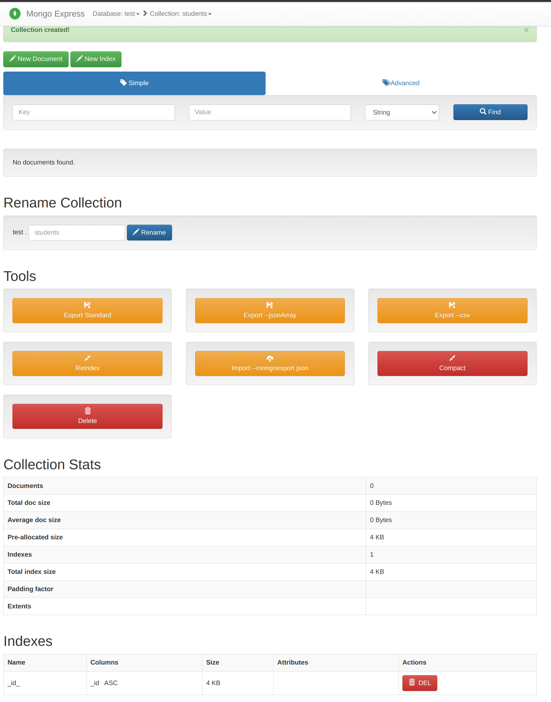

# **Лекция №42:Базовые возможности mongodb**
> _Разработка проекта_

## **Задание:**
Домашнее задание
MongoDB

Цель:
Научиться разворачивать MongoDB, заполнять данными и делать запросы.

Описание/Пошаговая инструкция выполнения домашнего задания:
Необходимо:

установить MongoDB одним из способов: ВМ, докер;
заполнить данными;
написать несколько запросов на выборку и обновление данных

Сдача ДЗ осуществляется в виде миниотчета.

___________________________________________________________________________________________________

Задание повышенной сложности*

создать индексы и сравнить производительность.

Критерии оценки:
задание выполнено - 10 баллов
предложено красивое решение - плюс 2 балла
предложено рабочее решение, но не устранены недостатки, указанные преподавателем - минус 2 балла
плюс 5 баллов за задание со звездочкой*

---

## **Выполнено:**

### 1. Запускаем MongoDB через `docker-compose`

~~~bash
docker-compose up -d
~~~

### 2. Создаем базу и коллекцию

### 3. Заполняем данными:

~~~bash
docker-compose exec mongodb bash
~~~

~~~console
mongoimport -u "admin" -p "password" --authenticationDatabase "admin" --db test --collection students --type json --file /tmp/stud.json

2024-12-23T21:00:03.655+0000    connected to: mongodb://localhost/
2024-12-23T21:00:03.663+0000    15 document(s) imported successfully. 0 document(s) failed to import.
~~~

### 4. Запросы на выборку и обновление данных

~~~bash
mongosh --authenticationDatabase  "admin" -u "admin" -p "password"
~~~

#### Выборка
~~~mongodb
-- 2 записи
db.students.find({}).limit(2)

-- 2 записи с сортировкой по полю 'name'
db.students.find({}).limit(2).sort({name: 1})

-- Найти студентов, у которых оценка за экзамен больше 70
db.students.find({ "scores": { $elemMatch: { type: "exam", score: { $gt: 70 } } } })

-- Отсортировать студентов по баллам за экзамен по убыванию
db.students.find({ "scores.type": "exam" }).sort({ "scores.score": -1 })

-- Выбрать только имена студентов и их средний балл
db.students.aggregate([
  {
    $project: {
      name: 1,
      averageScore: { $avg: "$scores.score" }
    }
  }
])
~~~

####  Обновление данных

~~~
-- Обновить имя студента по _id
db.students.find({_id: 1})
[
  {
    _id: 1,
    name: 'Aurelia Menendez',
    scores: [
      { score: 60.06045071030959, type: 'exam' },
      { score: 52.79790691903873, type: 'quiz' },
      { score: 71.76133439165544, type: 'homework' }
    ]
  }
]

db.students.updateOne(
  { _id: 1 },
  { $set: { name: "Updated Name" } }
)

 db.students.find({_id: 1})
[
  {
    _id: 1,
    name: 'Updated Name',
    scores: [
      { score: 60.06045071030959, type: 'exam' },
      { score: 52.79790691903873, type: 'quiz' },
      { score: 71.76133439165544, type: 'homework' }
    ]
  }
]
~~~

~~~mongodb
-- Добавить новый тип оценки для всех студентов
db.students.updateMany(
  {},
  { $push: { scores: { type: "extra", score: 50 } } }
)
~~~

~~~
-- Увеличить оценку за экзамен на 10 для студента с _id = 2
db.students.find({_id: 2})
[
  {
    _id: 2,
    name: 'Corliss Zuk',
    scores: [
      { score: 67.03077096065002, type: 'exam' },
      { score: 6.301851677835235, type: 'quiz' },
      { score: 66.28344683278382, type: 'homework' },
      { type: 'extra', score: 50 }
    ]
  }
]

db.students.updateOne(
  { _id: 2, "scores.type": "exam" },
  { $inc: { "scores.$.score": 10 } }
)

db.students.find({_id: 2})
[
  {
    _id: 2,
    name: 'Corliss Zuk',
    scores: [
      { score: 77.03077096065002, type: 'exam' },
      { score: 6.301851677835235, type: 'quiz' },
      { score: 66.28344683278382, type: 'homework' },
      { type: 'extra', score: 50 }
    ]
  }
]
~~~

### Удаление

~~~mongodb
-- Удалить студента по _id

db.students.deleteOne({ _id: 3 })

db.students.find({_id: 3})
~~~

### Агрегация

~~~
-- Найти студента с максимальным баллом за экзамен
 db.students.aggregate([
...   { $unwind: "$scores" },
...   { $match: { "scores.type": "exam" } },
...   { $sort: { "scores.score": -1 } },
...   { $limit: 1 }
... ])
[
  {
    _id: 9,
    name: 'Sanda Ryba',
    scores: { score: 97.00509953654694, type: 'exam' }
  }
]
~~~