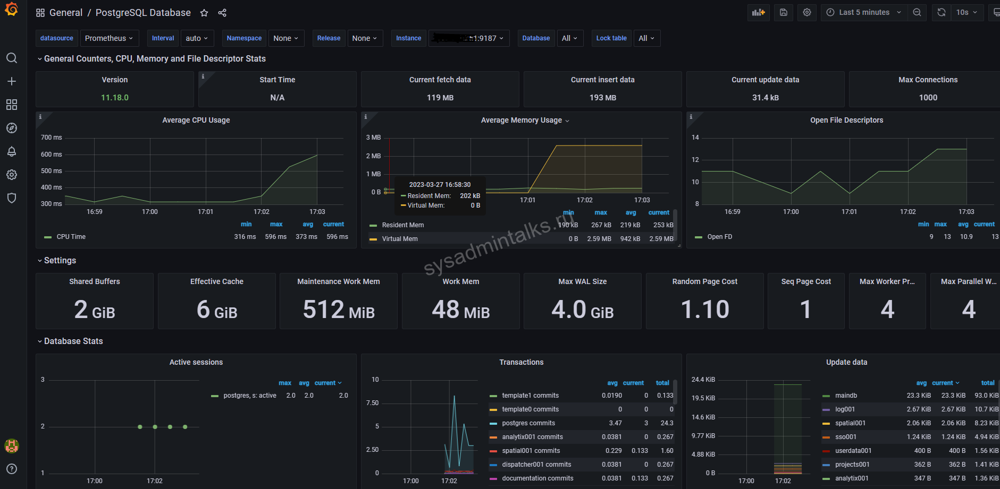

# **Проектная работа**
> _Сравнение операторов PostgreSQL для Kubernetes_

## Содержание проекта

### Постановка задачи
Некоторое время назад у нас в проекте возникла задача по развертыванию обновленной версии нашего
платформенного решения на нескольких окружениях (разработка/демонстрация).
В используемых нами инструментальных решениях (Gitlab, Harbor) в качестве РСУБД применяется Postgres. 
Т.к. наше платформенное решение создано на базе ПО оркестрации контейнеризированных приложений Kubernetes, а также чтобы
не изобретать велосипед, мы решили рассмотреть известные операторы, позволяющие разворачивать базы данных 
PostgreSQL в Kubernetes и управлять ими.

### Рассматриваемые решения (+-)

- #### Zalando Postgres Operator
- #### Сloudnative-pg
- #### KubeDB
- #### StackGres
- #### Crunchy Data PostgreSQL Operator
- #### Stolon

- Метод установки оператора
### Критерии выбора решения
  Определение оператора К8s

- Настройка СУБД Postgres в этих решениях
- Варианты резервного копирования [по типу бекапа, по месту хранения, по методу (sql-скрипт/wal-g)](Тип Бекапа, Создание  sql-бэкапа на s3, Создание WAL-G бэкапа на s3)
- Интерфейс настройки и управления/сопровождения
- Управление нодами кластера Postgres (создание реплик,создание однонодных кластеров Postgres, геораспределение)
- Управление реквестами и лимитами нод кластера Postgres
- Управление системными настройками Postgres
- Создание и настройка безопасности ТУЗ
- Управление развертыванием ноды кластера Postgres через yaml - шаблон
- Управление пулом соединений
- Возможности мониторинга кластера Postgres
###***- Итоговое сравнение решений***

***### Производительность***
  #### Создание тестового стенда и скрипта тестирования
### Услуги поддержки (таблица)
### Возможность миграции СУБД решений (таблица) (from MSQL to 1 )
### Выводы (на основании 1+1+1 таблицы)

++ Детали

### Статьи:
Сравнение MySQL и PostgreSQL в 2023 году
https://habr.com/ru/companies/otus/articles/722304/

Операторы PostgreSQL для Kubernetes. Как мы выбирали идеальный вариант для организации системы DBaaS
https://habr.com/ru/companies/amvera/articles/799187/

Никогда не используйте MySQL, всегда используйте PostgreSQL
https://habr.com/ru/articles/857966/

https://github.com/akopytov/sysbench

https://postgrespro.ru/docs/postgrespro/16/pgbench

https://github.com/prometheus-community/postgres_exporter

